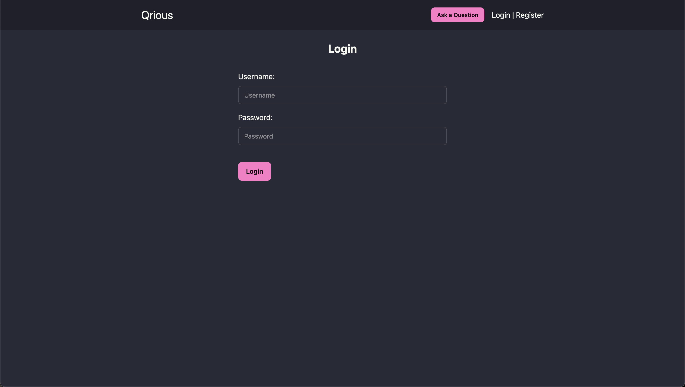
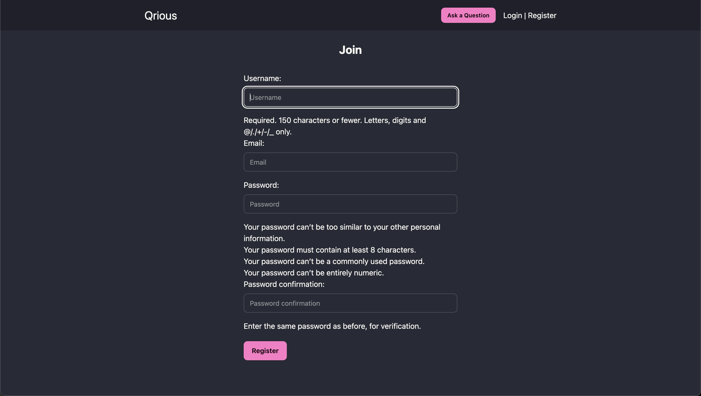
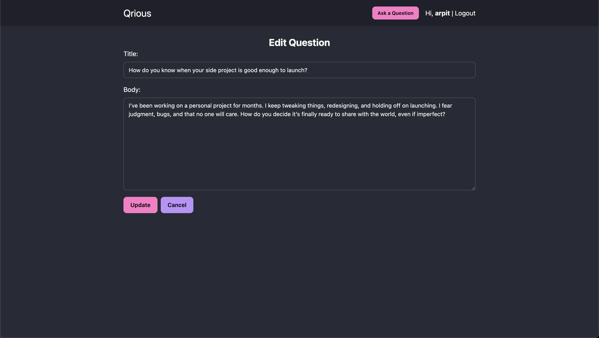
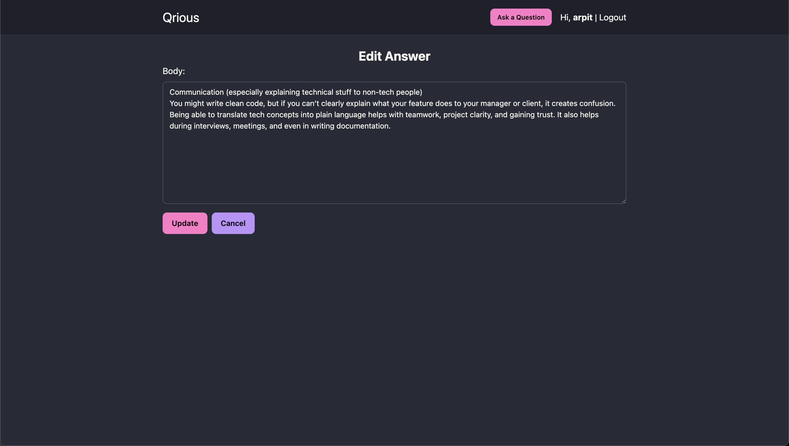

set up virtualenv

```bash
python3 -m venv env
source env/bin/activate
```

install requirements

```bash
pip install -r requirements.txt
```

migrate database

```bash
python manage.py migrate
```

run server

```bash
python manage.py runserver
```

## Screenshots

### Full page


### Login page



### Register page



### After login


### Question detail with answers


### Edit question



### Edit answer


